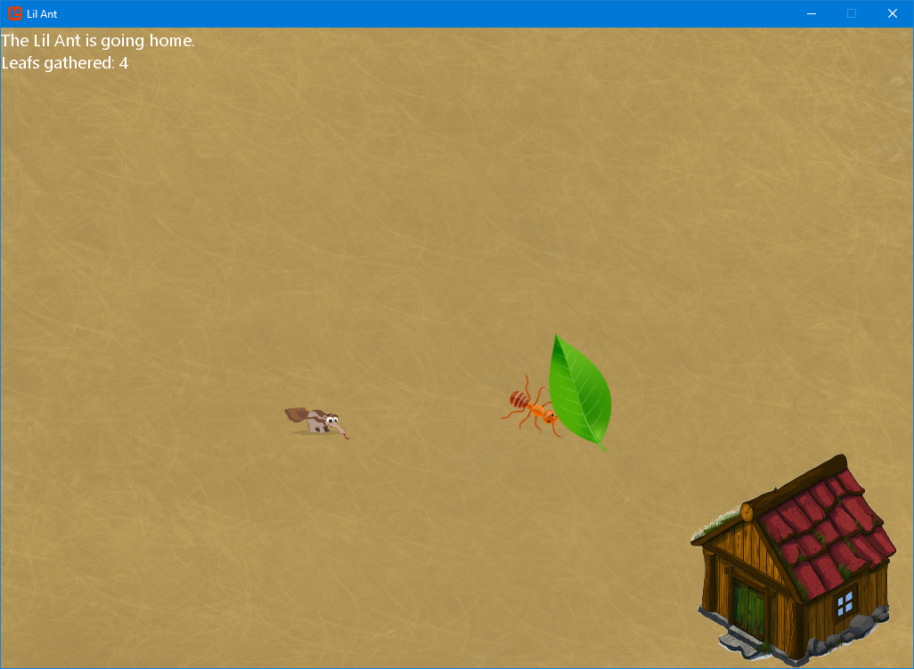
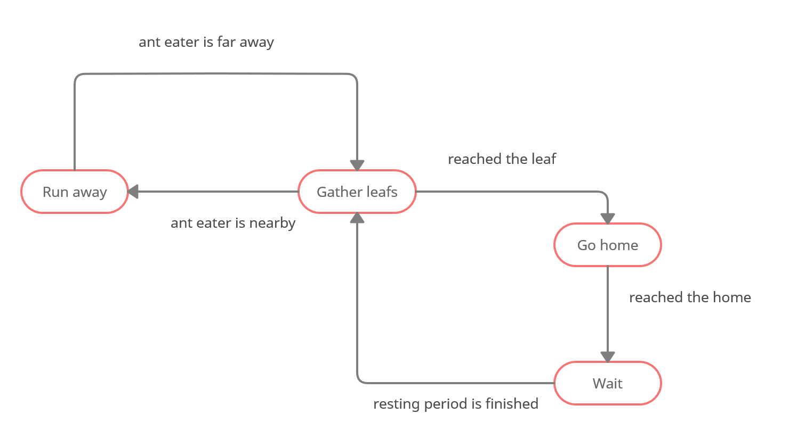
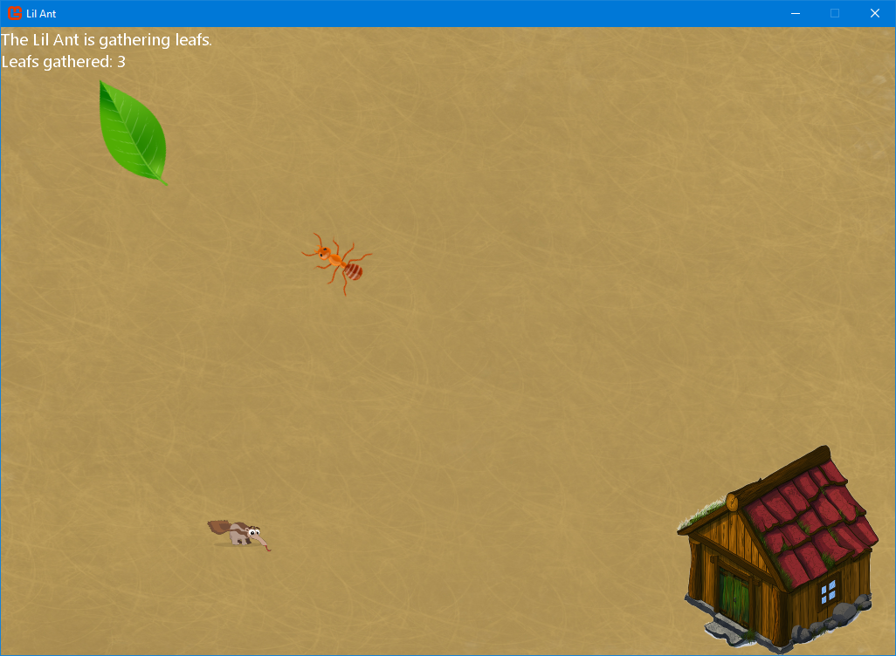
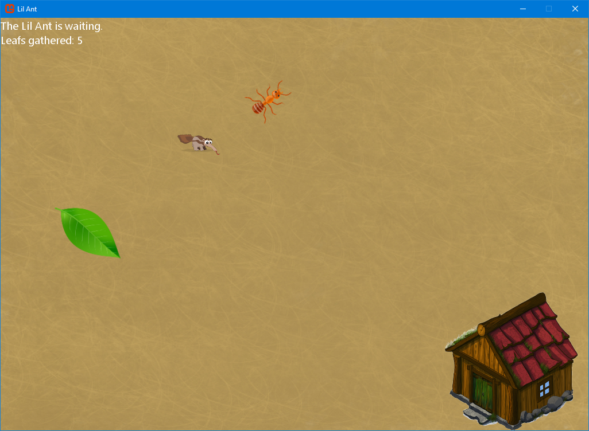

# Lil Ant Game
This project is a fun game based on the [MonoGame library](https://www.monogame.net/). The library lets you create cross-platform games by offering features such as: game framework, 2D rendering and handing user inputs. 

 The user plays as the ant eater who chase the ant in her journey of gathering leafs. The user can control the ant eater by moving the mouse. The ant moves automatically and her behaviour is predicted by a state machine. The ant will try to gather as many leafs as possible but avoiding the ant eater. You can make the ant to run away if you bring the ant eater too close to the little creature. 

You can give it a try by download it from the the latest [release](https://github.com/itivadar/LilAnt-Game/releases/download/v1.2/LilAnt-Gamre.zip).

##### [Show me more screenshots](#Screenshots)

# The state machine
The ant behaviour is defined by a state machine. Each state represents an action that the ants takes. The transitions between these states are based on conditions that needs to be met. 

The ant will not go for the leaf if the ant eater is too close.

# Screenshots

